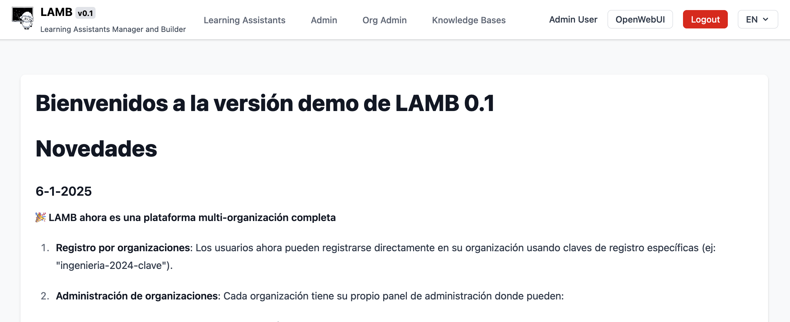
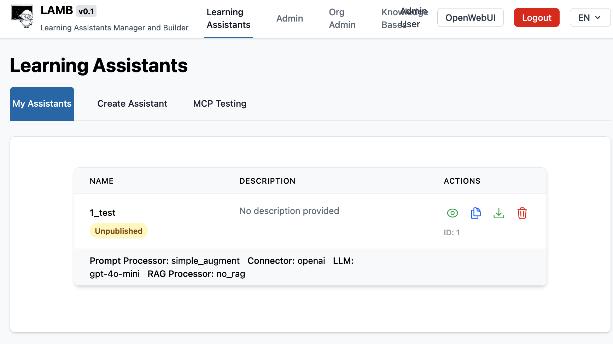
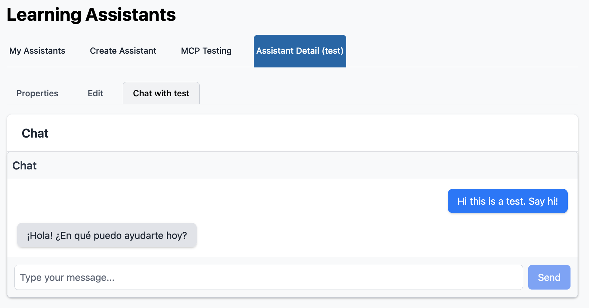

# Lamb final setup

Asuming you have successfully followed the instruction on [installationguide.md] or [docker.md] and lamb is running follow these steps to finish the setup and test it. 

# Log in as admin

the admin user and initial password is located at ./backend/.env on the variables you should modify before starting the containers.  Note: these variables are only used in the case tha admin user does nmot exist. If you change them after the fact it will not have any effect 

```
OWI_ADMIN_EMAIL=admin@owi.com
OWI_ADMIN_NAME=Admin User
OWI_ADMIN_PASSWORD=admin
```

On your browser go to http://localhost:9099 (or the adress where you have pointed lamb-backend to). Log in with the previosu credetials and log in. You shoudl see something like:



## Troubleshoting

If you are not able to log in with the admin user it means 
1- Lamb is working 
2- Lamb has problems communicating with openwebui  OR the username and password are wrong (you need to user your email , not the username... yes we shoudl make both wor!)

Check the console logs, and ensure all the paths exist and are correct. Ask for help on https://github.com/Lamb-Project/lamb 

# Create a test assistant

Just go to assitants->Create Assistant then assign a name to your test assitant ("test" for example) and hit save.

Now go to the list of assitants and you shoudl see:



Now click on the name of the assitant or click on the eye icon thing ("view"). Then you can go to the "chat with {assitant name}" and ty to chat with it. 



If you make it so far it means that the Lamb system is working, that the openai api key works fine and shoudl celebrate with a litle victory dance. Just a litle one, do not get ahead of yourself.

# Troubleshoting

Problems at this step can arise with the OPENAI_API_KEY ( you shoudl also test an assitant using ollama as model provider if you intend to use this connection) or because the ./frontend /static/config.js has some kind of problem. 

# Setup openwebui 

Openwebui is the open source software Lamb uses as main chat client. We have several integrations between Lamb and OpenWebui that eed to work well for lamb to work as intended. On the lamb web interface you have a "openWebui" button on the top right corner. By pressing this button you will be redirected to the openwebui web interface logged as your current user. If you are the lamb admin you will be adnmin on openwebui as well. 

Go to Your user menu and get to the "Admin Panel", on the "Settings" tab, choose the "Connections" option on the side bar. Now you need to:
* Edit the OpenAi connection and change the endpoint to **lamb-backend** on your system, and use as API KEY the value of PIPELINES_BEARER_TOKEN on backend/.env (that you should change for a secure key that no one knows). If you are using the Docker option it shoudl look like this. 


Now Openwebui can access LAMB and you can chat with your etst assitant on a new chat on openwebui. 

## Troubleshoting

If this fails here it means Openwebui can't access the LAMB API or that the API key is wrong. Check the console logs.  
